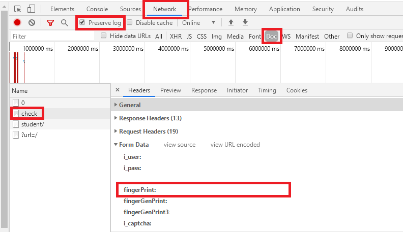

## wlxt

A shell script for linux to mimic part of the behaviour of learn.tsinghua.edu.cn. You need to download nodejs for encrypting your password. Make sure the command `jq` is available.
```bash
    sudo apt install nodejs jq
```

### Before using:

No script is written for double authenticating in id.tsinghua.edu.cn, so a `fingerPrint` parameter is needed. You should open learn.tsinghua.edu.cn in a browser, press `F12` to open developer tools, click `Network`, tick `preserve log`, filter only `documents`, and then log in to your account: 



After logging in, an action with name `check` will appear on the left. Find the value of key `fingerPrint` in its form data. Then use
```bash
    wlxt config finger <your_fingerPrint>
```

### Supported (sub)commands:

`help`: Displaying a help message.  
`config`: Setting your basic information.  
`kc`: Showing courses.  
`zy`: Showing homework.  
`xzzy`: Downloading homework.  
`ckzy`: Viewing the instructions of a homework.  
`tjzy`: Handing in homework.  
`wj`: Showing all course files.  
`xzwj`: Downloading course files.  
`refresh`: Deleting cache.

Use `wlxt help` or refer to [help](./help) for more information.